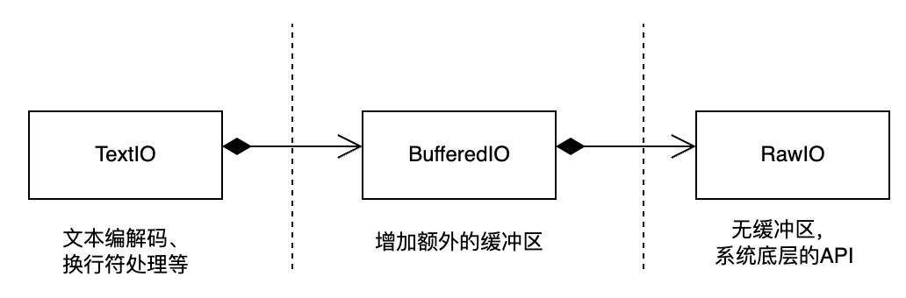

# 标准库: io


三种主要类型的i/o：

1. 文本io：二进制io基础上封装的高级api，处理文本流，多了编解码等操作；
2. 二进制io：raw io基础上封装的高级api，处理二进制流；
3. raw io：底层低级别API，手动管理文件指针、读取字节等；

三种类型的i/o可以对应各式各样的后端存储，比如文件系统、内存等。

某种IO类型对应的一个具体的IO对象，称作file object，或stream，或file-like object。

python中三种类型的i/o流，其都继承自`io.IOBase` 抽象类。

类的层级关系：

1. `IOBase`是所有类的基类.
2. `BufferedIOBase`  **has a** `RawIOBase` .
3. `TextIOBase`  **has a** `BufferedIOBase` .

## Text I/O
text i/o 用于`str`对象。

主要解决了从二进制数据到`str` 的透明转换，包括编码、解码、换行符转换。

利用`open` 方法可以快速创建文本流。

```python
>>> open("myfile.txt", "r", encoding="utf-8")
<_io.TextIOWrapper name='myfile.txt' mode='w' encoding='utf-8'>
```
也可以=主动创建一个text i/o对象，管理内存中的文本流。

```python
>>> io.StringIO('some initial text data')
<_io.StringIO at 0x1044ca430>
```
text stream的基类是`TextIOBase` ，提供了基于字符和行的操作接口。

基类：

*class* io.TextIOBase

&emsp;encoding：成员，`str`对象，编码方式；

&emsp;newlines：对换行符的转换方式，默认情况下`\n`，`\r`和`\r\n` 都会被转译成统一的`\n` ;

&emsp;buffer：底层处理的二进制buffer，是`BufferedIOBase` 的对象；

&emsp;read(size=-1, /)：读取字符的接口，非阻塞，如果当前流没有新内容，返回为空。

&emsp;readline(size=-1, /)：读取行的接口；

&emsp;write(s, /)：将`str`写入text stream，返回值是写入字符数量。

&emsp;tell()：返回当前流的位置，该位置不一定表示二进制存储的字节数。

&emsp;seek(offset, whence=SEEK\_SET, /)：根据指定偏置改变当前流的位置。

子类：

*class* io.TextIOWrapper(*buffer*, *encoding=None*, *errors=None*, *newline=None*, *line\_buffering=False*, *write\_through=False*)

&emsp;子类，提供对BufferedIOBase的高级接口。

*class* io.StringIO(*initial\_value=''*, *newline='\\n'*)

&emsp;子类，后端使用内存存储的文本流，可读写。

典型的text file还包括：`sys.stdin`, `sys.stdout`, `sys.stderr`

## Binary I/O
binary i/o又称作buffered i/o，应用于`bytes`对象，意味着没有编解码和换行符转换。

二进制流的基类是`BufferedIOBase` ，它会在底层使用一个内部缓冲区来存储数据。缓冲区是指 Python 在内存中维护的用于临时存储数据的区域，和操作系统的 I/O 缓冲区都用于提高读取和写入的效率，但它们并不是完全相同的概念。

同样，`open`方法可以快速从文件或内存创建二进制流。

```python
>>> open("myfile.jpg", "rb")
<_io.BufferedWriter name='myfile.jpg'>
>>> io.BytesIO(b"some initial binary data: \x00\x01")
<_io.BytesIO at 0x105a78f90>
```
基类：

*class* io.BufferedIOBase

&emsp;raw：底层调用的`RawIOBase` 对象；

&emsp;read(size=-1, /)：读取并返回size个`bytes` ，底层读取数据可能是多个并行的。

&emsp;read1(size=-1, /)：确保只进行一次底层raw stream的read。

&emsp;readinto(b, /): 读取bytes到分配好的bytes-like 对象b中，比如`bytearray` ，返回读取的字节数。

&emsp;write(b, /): 将bytes-like对象b写出输出流，返回写出的字节数。

子类：

*class* io.BytesIO(*initial\_bytes=b''*)

&emsp;子类，后端使用内存存储的二进制流，可读写。

*class* io.BufferedReader(*raw*, *buffer\_size=DEFAULT\_BUFFER\_SIZE*)

&emsp;子类，提供对可读的RawIOBase的高级接口

*class* io.BufferedWriter(*raw*, *buffer\_size=DEFAULT\_BUFFER\_SIZE*)

&emsp;子类，提供对可写的RawIOBase的高级接口

## Raw I/O
又称作unbuffered i/o，很少直接用于客户代码，更多的是用于构建上层的io。

`RawIOBase` 类的子类通常是直接与底层文件描述符或句柄进行交互，而不涉及额外的缓冲区。

```python
>>> open("myfile.jpg", "wb", buffering=0)
<_io.FileIO name='myfile.jpg' mode='wb' closefd=True>
```
原始流通常提供对底层操作系统设备或API对低级访问。

基类：

*class* io.RawIOBase

&emsp;read(size=-1, /): 读取并返回二进制数据；

&emsp;readall()：读取全部的二进制数据；

&emsp;readinto(b, /)：将二进制数据读取到bytes-like对象中；

&emsp;write(b, /)：将二进制数据写出到原始流；

子类：

*class* io.FileIO(*name*, *mode='r'*, *closefd=True*, *opener=None*)


&emsp;表示包含字节数据的操作系统级文件的原始二进制流，更底层接口，直接作用于底层文件描述符或句柄，不涉及额外的缓冲区。  

&emsp;name可以是文件路径或文件描述符（整数）。

